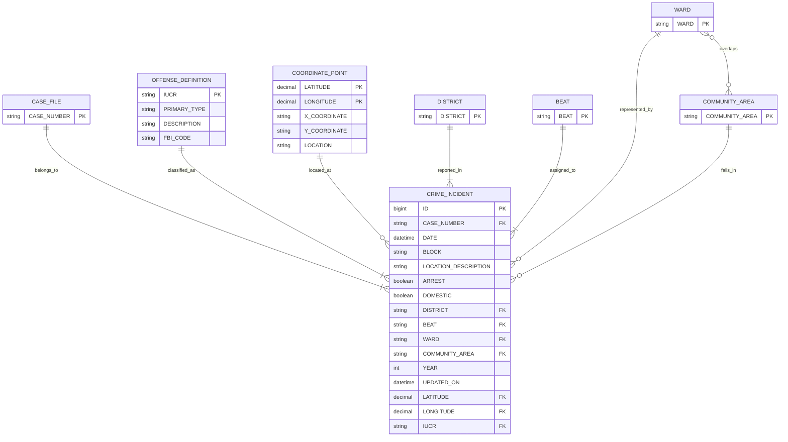

# Data Warehousing and Business Intelligence

## Selected Scenario

### Urban Public Safety Incident Response and Community Risk Intelligence

This is a police incident dataset for a public-safety DW/BI scenario. The source is OLTP-style because each row is a recorded incident, not a pre-built fact table or OLAP cube.

## Original Dataset

- Raw file: `Data/Crimes_-_2001_to_Present_20260321.csv`
- Source: City of Chicago Data Portal, `Crimes - 2001 to Present`
- Grain: one row per incident
- Local row count: `759,161`
- Column count: `22`
- Local `Date` range: `2023-01-01 00:00:00` to `2026-01-01 00:00:00`

### Important Note

Although the original public dataset spans 2001 to the present, the local stored snapshot currently used for the assignment includes records from January 1, 2023, to January 1, 2026. This reduced range keeps the source large enough for DW/BI work while remaining practical for ETL and reporting.

## Prepared Data Sources

The raw dataset was separated into three meaningful prepared sources using only original source columns.

| Source | Type | Rows | Primary key | Foreign keys / relationship |
|---|---|---:|---|---|
| `Data/crimes_original_reduced.csv` | CSV | `759,161` | `ID` | `Case Number`, `IUCR`, `District`, `Beat`, `Ward`, `Community Area`, and non-null `(Latitude, Longitude)` reference lookup entities in the ER model |
| `Data/offense_source.txt` | Text (tab-delimited) | `359` | `IUCR` | Referenced by `crimes_original_reduced.csv` |
| `Data/coordinate_source.xlsx` | XLSX | `248,591` | `(Latitude, Longitude)` | Referenced by `crimes_original_reduced.csv` for non-null coordinate pairs |

This gives:

- `3` prepared source files
- `3` source types: `CSV`, `Text`, and `XLSX`

## Raw Columns Were Split As Follows

### Kept in `crimes_original_reduced.csv`

- `ID`
- `Case Number`
- `Date`
- `Block`
- `Location Description`
- `Arrest`
- `Domestic`
- `Beat`
- `District`
- `Ward`
- `Community Area`
- `Year`
- `Updated On`
- `Latitude`
- `Longitude`
- `IUCR`

### Moved to `offense_source.txt`

- `IUCR`
- `Primary Type`
- `Description`
- `FBI Code`

### Moved to `coordinate_source.xlsx`

- `Latitude`
- `Longitude`
- `X Coordinate`
- `Y Coordinate`
- `Location`

`Latitude` and `Longitude` remain in the incident source because they are the natural composite foreign key to the coordinate lookup and already exist in the original dataset.

## Key Validation

The split was validated after generation.

- `ID` is unique in `crimes_original_reduced.csv`
- `IUCR` is unique in `offense_source.txt`
- `(Latitude, Longitude)` is unique in `coordinate_source.xlsx` for non-null pairs
- Missing `IUCR` foreign keys: `0`
- Missing non-null coordinate foreign keys: `0`
- Duplicate incident IDs found: `0`
- Inconsistent `IUCR` definitions found: `0`
- Inconsistent coordinate definitions found: `0`
- Surrogate keys added during source preparation: `0`

Validation report:

- `Data/source_validation.txt`

## Corrected Logical Source Model

Key ER notes:

- all modeled entities are strong entities
- `Crime Incident` is the central transactional entity keyed by `ID`
- `Year` is a derived attribute from `Date`
- `Coordinate Point` uses the composite key `(Latitude, Longitude)`
- `Case File`, `Offense Definition`, `District`, and `Beat` have total participation from `Crime Incident`
- `Coordinate Point`, `Ward`, and `Community Area` have partial participation from `Crime Incident`
- `Ward` and `Community Area` form an observed `N:N` overlap in the prepared source snapshot
- `District -> Beat` is not modeled as a direct hierarchy because the current snapshot contains beats associated with multiple districts

For the full ER explanation with entities, attributes, PKs, FKs, relationships, and cardinalities, see:

- `diagrams/README.md`

## Assignment

| Requirement | Status | Notes |
|---|---|---|
| OLTP dataset only | Satisfied | Incident-level operational records |
| Not AdventureWorks | Satisfied | Public-safety dataset |
| Around one year or more | Satisfied | More than three years in the local snapshot |
| Enough records and attributes | Satisfied | 759,161 rows, 22 original columns |
| Three raw data sources | Satisfied | Incident CSV, offense TXT, and coordinate XLSX prepared for ETL |
| At least two source types | Satisfied | CSV, text, and XLSX sources |
| Meaningful PK/FK relationships | Satisfied | `ID`, `Case Number`, `IUCR`, and `(Latitude, Longitude)` support the ER structure |
| Suitable for DW design, SSAS, reporting | Satisfied | Clear fact and dimension candidates |

## Data Warehouse Use

Candidate warehouse structures:

- `FactIncident`
- `DimDate`
- `DimOffense`
- `DimLocation`
- `DimPoliceArea`

Supported hierarchies and analysis paths:

- `Year -> Quarter -> Month -> Day`
- `Primary Type -> Description -> IUCR`
- `District` and `Beat` can both be analyzed in `DimPoliceArea`, but the current source snapshot does not support a clean source-side `District -> Beat` hierarchy without additional cleansing
- `Ward` and `Community Area` should be treated as descriptive geography attributes, not as a strict hierarchy
