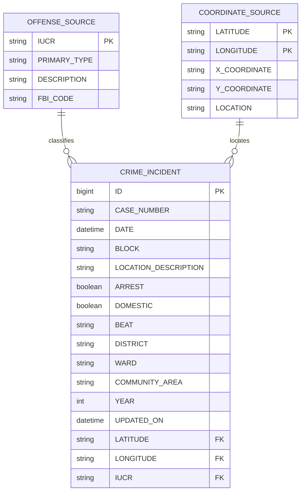

# Data Warehousing and Business Intelligence Assignment

## Selected Scenario

### Urban Public Safety Incident Response and Community Risk Intelligence

This project uses a police incident dataset for a public-safety DW/BI scenario. The source is OLTP-style because each row is a single recorded incident, not a pre-built fact table or OLAP cube.

## Original Dataset in the Repo

- Raw file: `data/Crimes_-_2001_to_Present_20260321.csv`
- Source: City of Chicago Data Portal, `Crimes - 2001 to Present`
- Grain: one row per incident
- Local row count: `759,161`
- Column count: `22`
- Local `Date` range: `2023-01-01 00:00:00` to `2026-01-01 00:00:00`

Important note:
The public dataset title says `2001 to Present`, but the local snapshot currently stored in this repository contains records from January 1, 2023 through January 1, 2026.

## Prepared Data Sources

The raw dataset has been separated into three meaningful raw sources using only original columns from the source data. No surrogate keys were introduced at this stage.

| Source | Type | Rows | Primary key | Foreign keys / relationship |
|---|---|---:|---|---|
| `data/crimes_original_reduced.csv` | CSV | `759,161` | `ID` | `IUCR -> offense_source.txt.IUCR`; `(Latitude, Longitude) -> coordinate_source.csv.(Latitude, Longitude)` for non-null pairs |
| `data/offense_source.txt` | Text (tab-delimited) | `359` | `IUCR` | Referenced by `crimes_original_reduced.csv` |
| `data/coordinate_source.csv` | CSV | `248,591` | `(Latitude, Longitude)` | Referenced by `crimes_original_reduced.csv` for non-null pairs |

This gives:

- `3` raw data sources
- at least `2` source types: `CSV` and `Text`

## How the Raw Columns Were Split

### Kept in `crimes_original_reduced.csv`

- `ID`
- `Case Number`
- `Date`
- `Block`
- `Location Description`
- `Arrest`
- `Domestic`
- `Beat`
- `District`
- `Ward`
- `Community Area`
- `Year`
- `Updated On`
- `Latitude`
- `Longitude`
- `IUCR`

### Moved to `offense_source.txt`

- `IUCR`
- `Primary Type`
- `Description`
- `FBI Code`

### Moved to `coordinate_source.csv`

- `Latitude`
- `Longitude`
- `X Coordinate`
- `Y Coordinate`
- `Location`

Why `Latitude` and `Longitude` remain in the incident source:

- they are the natural composite foreign key to `coordinate_source.csv`
- they already exist in the original dataset
- no generated key was needed

## Key Validation

The split was validated after generation.

- `ID` is unique in `crimes_original_reduced.csv`
- `IUCR` is unique in `offense_source.txt`
- `(Latitude, Longitude)` is unique in `coordinate_source.csv` for non-null pairs
- Missing `IUCR` foreign keys: `0`
- Missing non-null coordinate foreign keys: `0`
- Duplicate incident IDs found: `0`
- Inconsistent `IUCR` definitions found: `0`
- Inconsistent coordinate definitions found: `0`
- Surrogate keys added during source preparation: `0`

Validation report:

- `data/source_validation.txt`

## Logical Source Model

## Assignment Fit

| Requirement | Status | Notes |
|---|---|---|
| OLTP dataset only | Satisfied | Incident-level operational records |
| Not AdventureWorks | Satisfied | Public-safety dataset |
| Around one year or more | Satisfied | More than three years in the local snapshot |
| Enough records and attributes | Satisfied | 759,161 rows, 22 original columns |
| Three raw data sources | Satisfied | Incident, offense, and coordinate sources created |
| At least two source types | Satisfied | CSV and text sources created |
| Meaningful PK/FK relationships | Satisfied | `ID`, `IUCR`, and `(Latitude, Longitude)` validated without surrogate keys |
| Suitable for DW design, SSAS, reporting | Satisfied | Clear fact and dimension candidates |

## Suggested DW Use

Candidate warehouse structures:

- `FactIncident`
- `DimDate`
- `DimOffense`
- `DimLocation`
- `DimPoliceArea`

Useful hierarchies:

- `Year -> Quarter -> Month -> Day`
- `District -> Beat`
- `Primary Type -> Description -> IUCR`
