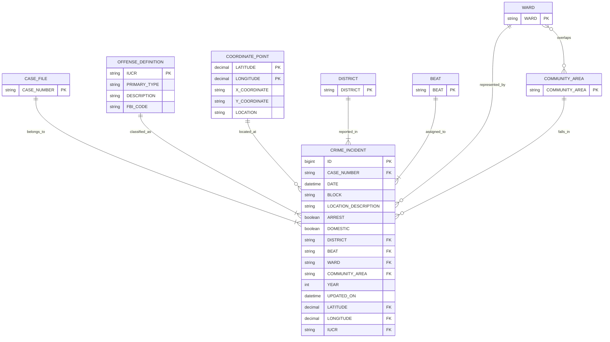

# Diagram Notes

## Corrected ER Scope

The ER model describes the prepared source snapshot used for ETL.

The prepared source files currently available in the workspace are:

- `Data/crimes_original_reduced.csv`
- `Data/offense_source.txt`
- `Data/coordinate_source.xlsx`

The ER diagram should be derived from the values that actually occur in those files, not from a cleaned ideal city-administration hierarchy.

## 1. Identify The Entities

These are the entities that should appear in the ER model for the prepared source snapshot:

- `Crime Incident`
  One row per incident from `crimes_original_reduced.csv`
  Distinct rows: `759,161`
- `Case File`
  One row per distinct `Case Number`
  Distinct values: `759,088`
- `Offense Definition`
  One row per distinct `IUCR`
  Distinct values: `359`
- `Coordinate Point`
  One row per distinct non-null `(Latitude, Longitude)` pair from `coordinate_source.xlsx`
  Distinct values: `248,591`
- `District`
  One row per distinct district code
  Distinct values: `23`
- `Beat`
  One row per distinct beat code
  Distinct values: `275`
- `Ward`
  One row per distinct non-null ward code
  Distinct values: `50`
- `Community Area`
  One row per distinct non-null community-area code
  Distinct values: `77`

## 2. Determine The Entity Types

All eight entities are strong entities.

Reason:

- `Crime Incident` has its own identifier: `ID`
- `Case File` has its own identifier: `Case Number`
- `Offense Definition` has its own identifier: `IUCR`
- `Coordinate Point` has its own composite identifier: `(Latitude, Longitude)`
- `District`, `Beat`, `Ward`, and `Community Area` each use their own code value as identifier

No weak entity is needed in the final ER model.

## 3. Define The Attributes Of The Entities

### Crime Incident

- Primary key: `ID`
- Foreign keys:
  - `Case Number -> Case File.Case Number`
  - `IUCR -> Offense Definition.IUCR`
  - `(Latitude, Longitude) -> Coordinate Point.(Latitude, Longitude)` for non-null pairs
  - `District -> District.District`
  - `Beat -> Beat.Beat`
  - `Ward -> Ward.Ward` when not null
  - `Community Area -> Community Area.Community Area` when not null
- Non-key attributes:
  - `Date`
  - `Block`
  - `Location Description`
  - `Arrest`
  - `Domestic`
  - `Year`
  - `Updated On`

### Case File

- Primary key: `Case Number`
- Additional attributes in the prepared source snapshot: none

### Offense Definition

- Primary key: `IUCR`
- Attributes:
  - `Primary Type`
  - `Description`
  - `FBI Code`

### Coordinate Point

- Composite primary key:
  - `Latitude`
  - `Longitude`
- Attributes:
  - `X Coordinate`
  - `Y Coordinate`
  - `Location`

### District

- Primary key: `District`
- Additional attributes in the prepared source snapshot: none

### Beat

- Primary key: `Beat`
- Additional attributes in the prepared source snapshot: none

### Ward

- Primary key: `Ward`
- Additional attributes in the prepared source snapshot: none

### Community Area

- Primary key: `Community Area`
- Additional attributes in the prepared source snapshot: none

## Attribute-Type Notes

- Single-value attributes:
  All attributes shown in this prepared source snapshot are single-value.
- Composite key:
  `Coordinate Point` uses `(Latitude, Longitude)` as a composite key.
- Derived attribute:
  `Year` is derived from `Date`, so it can be shown as a derived attribute in Chen notation.
- Multivalued attributes:
  none were identified in the prepared source snapshot.
- Composite descriptive attributes:
  none are required for the final ER model.

## 4. Define The Relationships Between Entities

These are the relationships that should be shown in the ER model:

- `belongs to`
  Between `Crime Incident` and `Case File`
  Meaning: each incident is recorded under one case number.
- `classified as`
  Between `Crime Incident` and `Offense Definition`
  Meaning: each incident uses one `IUCR` offense definition.
- `located at`
  Between `Crime Incident` and `Coordinate Point`
  Meaning: an incident may reference one coordinate pair when latitude and longitude are present.
- `reported in`
  Between `Crime Incident` and `District`
  Meaning: each incident has one district code in the prepared source.
- `assigned to`
  Between `Crime Incident` and `Beat`
  Meaning: each incident has one beat code in the prepared source.
- `represented by`
  Between `Crime Incident` and `Ward`
  Meaning: an incident may reference one ward code.
- `falls in`
  Between `Crime Incident` and `Community Area`
  Meaning: an incident may reference one community-area code.
- `overlaps`
  Between `Ward` and `Community Area`
  Meaning: ward and community-area values form an observed many-to-many geographic overlap in the prepared source snapshot.

## 5. Define The Cardinalities Of The Relationships

| Relationship | Cardinality | Participation Notes | Evidence From Snapshot |
|---|---|---|---|
| `Case File - Crime Incident` | `1:N` | Total on the `Crime Incident` side because `Case Number` has no missing values | `63` case numbers repeat; maximum occurrence of one case number is `4` |
| `Offense Definition - Crime Incident` | `1:N` | Total on the `Crime Incident` side because `IUCR` has no missing values | `359` valid `IUCR` values; missing offense foreign keys = `0` |
| `Coordinate Point - Crime Incident` | `1:N` for non-null coordinate pairs | Partial on the `Crime Incident` side because coordinates are blank in some rows | `4,261` incident rows have blank `Latitude` or `Longitude` |
| `District - Crime Incident` | `1:N` | Total on the `Crime Incident` side because `District` has no missing values | `23` district codes |
| `Beat - Crime Incident` | `1:N` | Total on the `Crime Incident` side because `Beat` has no missing values | `275` beat codes |
| `Ward - Crime Incident` | `1:N` | Partial on the `Crime Incident` side because `Ward` is sometimes blank | `4` incident rows have blank `Ward` |
| `Community Area - Crime Incident` | `1:N` | Partial on the `Crime Incident` side because `Community Area` is sometimes blank | `35` incident rows have blank `Community Area` |
| `Ward - Community Area` | `N:N` | Optional secondary geography relationship, not a hierarchy | `49` wards map to multiple community areas, and `70` community areas map to multiple wards |

## Important Modelling Correction

Do not draw a direct `District 1:N Beat` hierarchy in the ER model for this prepared source snapshot.

Reason:

- the policing semantics may suggest that one district contains many beats
- but the current source snapshot does not support a clean one-directional mapping
- `12` beat values appear under more than one district code in the prepared incident data

That means `District` and `Beat` should be modeled as separate strong entities connected directly to `Crime Incident`, not as a strict parent-child pair in the source ER.

## Recommended ER Diagram Content

Use the following structure when redrawing the ER:

Mermaid is used here only to show the corrected structure. The Chen-style drawing in `dwbi_models.drawio` should use the same entities, keys, relationships, and cardinality meanings described above.
